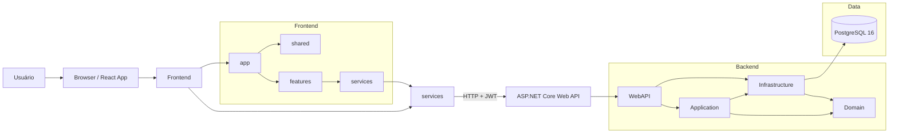
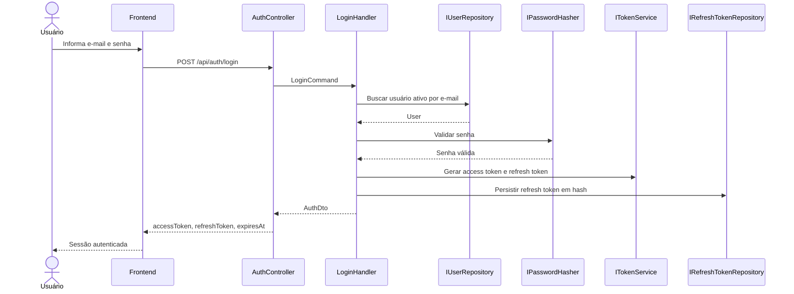
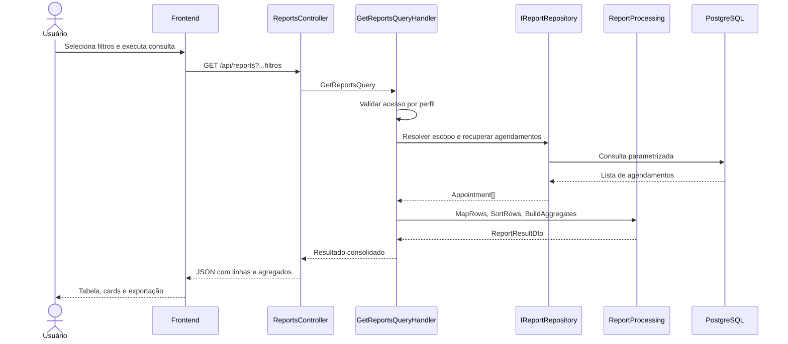

# AgendeX

AgendeX é um sistema web para gestão de agendamentos entre clientes, agentes e administradores. A solução foi estruturada para atender a prova técnica SENAI/FIESC com foco em organização, rastreabilidade, validação de regras de negócio e documentação técnica.

## Visão Geral

O sistema cobre o fluxo completo de agendamento de serviços:

- autenticação com JWT RS256 e refresh token;
- cadastro e manutenção de usuários;
- manutenção de detalhes do cliente;
- catálogo de tipos de serviço;
- janelas de disponibilidade por agente;
- criação, confirmação, rejeição, cancelamento, conclusão e remanejamento de agendamentos;
- relatórios com filtros, agregações, ordenação e exportação CSV/XLSX.

O backend segue Clean Architecture com separação por camadas e o frontend segue organização por feature, com componentes de apresentação, hooks de negócio e serviços de API.

## Stack Técnica

### Backend

- .NET 10
- C#
- ASP.NET Core Web API
- MediatR
- FluentValidation
- Entity Framework Core
- PostgreSQL 16
- JWT RS256
- Swashbuckle / Swagger
- AspNetCoreRateLimit
- BCrypt.Net-Next
- xUnit, Moq e FluentAssertions

### Frontend

- React 19
- TypeScript
- Vite
- Ant Design
- React Router DOM
- TanStack Query
- React Hook Form
- Zod
- Axios
- Zustand

### Infraestrutura

- Docker
- Docker Compose
- PostgreSQL 16

## Arquitetura

O backend está dividido em quatro camadas principais:

- Domain: entidades, enums e contratos de repositório.
- Application: casos de uso, DTOs, comandos, queries, validações e orquestração com MediatR.
- Infrastructure: persistência, repositórios, hashing, autenticação e implementação de integrações.
- WebAPI: controllers, middlewares, Swagger e composição da aplicação.

O frontend está organizado em módulos de domínio funcional, com a seguinte lógica:

- app: bootstrap, tema, providers e rotas.
- services: cliente HTTP e adaptadores de API.
- shared: componentes e utilitários reutilizáveis.
- features: módulos de negócio isolados.

### Diagrama de Componentes



Esse diagrama separa o caminho de execução do request do desenho das dependências internas: o frontend concentra a navegação e orquestração, enquanto `services` é a borda HTTP; no backend, `WebAPI` recebe a requisição e `Application` concentra os casos de uso, com `Infrastructure` fornecendo persistência e integrações.

### Diagrama de Sequência: Login



### Diagrama de Sequência: Consulta de Relatórios



## Decisões de Design

### Backend

- Clean Architecture para manter as dependências apontando para dentro da solução.
- CQRS com MediatR para separar consultas e comandos por caso de uso.
- Controllers finos, limitados à recepção de request e retorno de response.
- Validação com FluentValidation no mesmo arquivo do comando/query para manter o contrato e as regras próximos.
- Repositórios definidos em Domain e implementados em Infrastructure para reduzir acoplamento com persistência.
- `ICurrentUserService` para evitar leitura manual de claims em controllers.
- `ReportProcessing` centraliza normalização de filtros, ordenação, agregação e geração de nomes de arquivo.
- O escopo de relatórios é reforçado no backend, inclusive para perfis de agente, evitando depender da UI para autorização.

### Frontend

- Organização por feature para manter regras, páginas, componentes e tipos juntos.
- React Query para cache, revalidação e estados assíncronos.
- React Hook Form + Zod para formulários tipados e validação declarativa.
- Ant Design como biblioteca principal de UI para consistência visual e velocidade de entrega.
- Zustand para estado global leve, principalmente sessão e autenticação.
- Axios com interceptadores para ciclo de access token e refresh token.
- Páginas enxutas, delegando comportamento para hooks e componentes locais.

## Estrutura do Repositório

```text
backend/
  AgendeX.Domain/
  AgendeX.Application/
  AgendeX.Infrastructure/
  AgendeX.WebAPI/
  AgendeX.Tests/
  scripts/
frontend/
  src/
	app/
	services/
	shared/
	features/
docker-compose.yml
README.md
```

## Funcionalidades Entregues

### Autenticação

- login, logout e refresh token;
- JWT assinado com RS256;
- rotação de refresh token;
- rate limit no endpoint de login.

### Usuários

- listagem, criação, edição e exclusão lógica;
- atualização de detalhes do cliente;
- controle de acesso por perfil.

### Tipos de Serviço

- listagem e consulta por ID;
- base para filtros e formulários.

### Disponibilidade

- cadastro, edição, consulta e desativação de janelas de atendimento;
- cálculo de slots disponíveis por agente e data.

### Agendamentos

- criação pelo cliente;
- confirmação, rejeição, cancelamento, conclusão e remanejamento;
- filtros por cliente, agente, tipo de serviço, status e período.

### Relatórios

- filtros por cliente, agente, período, tipo de serviço, status e tipo de relatório;
- totais por agente, por cliente, por status, taxa de conclusão x cancelamento e distribuição por tipo de serviço;
- ordenação por colunas;
- exportação CSV e XLSX.

## Modelo de Domínio

### Entidades Principais

- User: dados de autenticação e perfil.
- ClientDetail: informações complementares do cliente.
- ServiceType: catálogo de serviços.
- AgentAvailability: janelas de disponibilidade por dia da semana.
- Appointment: agendamento com status e trilha de auditoria.
- RefreshToken: persistência segura do refresh token.

### Regras de Negócio Relevantes

- o agente só pode atender dentro de sua disponibilidade;
- não podem existir intervalos sobrepostos para o mesmo agente e dia da semana;
- o fluxo de status do agendamento é controlado por transições válidas;
- cancelamentos e conclusões respeitam o perfil do usuário e a situação do agendamento;
- relatórios são sempre filtrados e sanitizados no backend.

## Instalação e Execução

### Pré-requisitos

- .NET 10 SDK
- Node.js 22+ com npm
- Docker e Docker Compose

### 1. Subir o banco de dados

O `docker-compose.yml` atual sobe o PostgreSQL 16:

```bash
docker compose up -d db
```

Banco e credenciais padrão:

- host: `localhost`
- porta: `5432`
- database: `agendex`
- usuário: `agendex`
- senha: `agendex`

### 2. Executar o backend

```bash
dotnet restore backend/AgendeX.slnx
dotnet run --project backend/AgendeX.WebAPI/AgendeX.WebAPI.csproj
```

O backend usa por padrão a connection string configurada em `backend/AgendeX.WebAPI/appsettings.json` e expõe Swagger para exploração dos endpoints.

### 3. Executar o frontend

```bash
cd frontend
npm install
npm run dev
```

O frontend consome a API em `http://localhost:5150` por padrão, conforme `frontend/.env`.

### 4. Testes

```bash
dotnet test backend/AgendeX.Tests/AgendeX.Tests.csproj
```

## Guia de Manutenção

### Evolução do backend

- novas regras devem entrar em `AgendeX.Application/Features/<Módulo>`;
- comandos e queries devem manter validação com FluentValidation;
- mudanças de persistência devem ser refletidas em `AgendeX.Infrastructure`;
- novas regras de dados exigem atualização das migrations e das configurações EF Core;
- handlers devem continuar pequenos e com responsabilidade única.

### Evolução do frontend

- novas telas devem nascer dentro de `frontend/src/features`;
- a camada `services` deve se limitar a adaptadores HTTP;
- regras de tela devem ficar em hooks e não em componentes de apresentação;
- compartilhar apenas o que for realmente transversal entre módulos.

### Pontos de configuração

- `backend/AgendeX.WebAPI/appsettings.json`: connection string, JWT, rate limit e CORS;
- `frontend/.env`: URL base da API;
- `backend/scripts/seed-auth-user.sql`: apoio para carga inicial de usuário de autenticação.

## Observações Técnicas

- A aplicação prioriza separação de responsabilidades, legibilidade e baixo acoplamento.
- O backend protege regras sensíveis no servidor, especialmente em relatórios e permissões.
- O frontend é projetado para ser responsivo e manter a UI consistente com Ant Design.
- A documentação técnica aqui consolidada atende ao RQNF10, incluindo arquitetura, decisões de design, instalação e manutenção.
